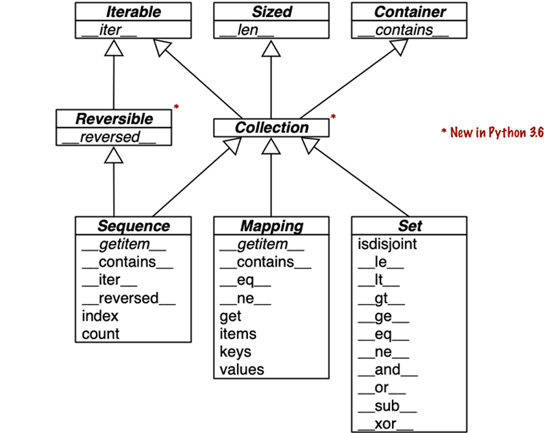

# 01. Python 数据模型

Back to [Chapters](..)

我们可以将数据模型视为对 Python 作为框架的描述。它规范了语言本身的构建块（例如序列、函数、迭代器、协程、类、上下文管理器等）的接口。

使用框架时，我们会花费大量时间编写由框架调用的方法。当我们利用 Python 数据模型构建新的类时，情况也是如此。Python 解释器会调用特殊方法来执行基本的对象操作，这通常由特殊的语法触发。这些特殊方法的名称始终以双下划线开头和结尾。例如，语法 `obj[key]` 由 `__getitem__` 特殊方法支持。为了实现 `my_collection[key]`，解释器会调用 `my_collection.__getitem__(key)`。

当我们希望我们的对象支持和与以下基本语言结构进行交互时，我们会实现特殊方法：

* 集合
* 属性访问 (Attribute access，类似 my_collection.key)
* 迭代 (包括使用async for进行异步迭代)
* 运算符重载
* 函数和方法调用
* 字符串表示和格式化
* 使用 await 进行异步编程
* 对象的创建和销毁 (Object creation and destruction)
* 使用 with 或 async with 语句进行管理的上下文

## 1.1 A Pythonic Card Deck

代码见 chapters/01-data-model/frenchdeck.py

    通过 实现 `__getitem__` 方法，让对象可被迭代；

    接着实现 `__len__` 方法，对象可用被排序；

    额外实现 `__getattr__` 方法，对象中字典实例可用通过属性方式调用：`assert deck[12] == deck.sa`

chapters/01-data-model/frenchdeck.doctest

    `python -m doctest <doctest file> -v` 或者在 pytest 中执行

    `pytest --doctest-modules <python file with doctest code>`

    ```python
    >>> for card in deck:  # doctest: +ELLIPSIS
    ...   print(card)
    Card(rank='2', suit='spades')
    Card(rank='3', suit='spades')
    Card(rank='4', suit='spades')
    ...
    ```

## 1.2 How Special Methods Are Used

本节主要内容

* Emulating numeric types
* String representation of objects
* Boolean value of an object
* Implementing collections



## 1.3 Overview of Special Methods

在 *Python Language Reference* [数据模型](https://docs.python.org/zh-cn/3/reference/datamodel.html) 这章中，列出了 80 多个魔术方法名称。

Table 1-1 shows special method names, excluding those used to implement infix operators or core math functions like abs.

Category | Method names
---:|---
String/bytes representation | `__repr__ __str__ __format__ __bytes__ __fspath__`
Conversion to number | `__bool__ __complex__ __int__ __float__ __hash__ __index__`
Emulating collections | `__len__ __getitem__ __setitem__ __delitem__ __contains__`
Iteration | `__iter__ __aiter__ __next__ __anext__ __reversed__`
Callable or coroutine execution | `__call__ __await__`
Context management | `__enter__ __exit__ __aexit__ __aenter__`
Instance creation and destruction | `__new__ __init__ __del__`
Attribute management | `__getattr__ __getattribute__ __setattr__ __delattr__ __dir__`
Attribute descriptors | `__get__ __set__ __delete__ __set_name__`
Abstract base classes | `__instancecheck__ __subclasscheck__`
Class metaprogramming | `__prepare__ __init_subclass__ __class_getitem__ __mro_entries__`

Infix and numerical operators are supported by the special methods listed in Table 1-2.

Table 1-2. Special method names and symbols for operators.

Operator category | Symbols | Method names
---:|---|---
Unary numeric | `- + abs()` | `__neg__ __pos__ __abs__`
Rich comparison | `< <= == != > >=` | `__lt__ __le__ __eq__ __ne__ __gt__ __ge__`
Arithmetic | `+ - * / // % @ divmod() round() ** pow()` | `__add__ __sub__ __mul__` ` __truediv__ ` `__floordiv__ __mod__` ` __matmul__ ` `__divmod__ __round__ __pow__`
Reversed arithmetic | (arithmetic operators with swapped operands) | `__radd__ __rsub__ __rmul__ __rtruediv__ __rfloordiv__ __rmod__ __rmatmul__ __rdivmod__ __rpow__`
Augmented assignment arithmetic | `+= -= *= /= //= %= @= **=` | `__iadd__ __isub__ __imul__ __itruediv__ __ifloordiv__ __imod__ __imatmul__ __ipow__`
Bitwise | `& | ^ << >> ~` | `__and__ __or__ __xor__ __lshift__ __rshift__ __invert__`
Reversed bitwise | (bitwise operators with swapped operands) | `__rand__ __ror__ __rxor__ __rlshift__ __rrshift__`
Augmented assignment bitwise | `&= |= ^= <<= >>=` | `__iand__ __ior__ __ixor__ __ilshift__ __irshift__`

## 1.4 Why len Is Not a Method

## 1.5 Chapter Summary

## 1.6 Further Reading

*Python Language Reference* [数据模型](https://docs.python.org/zh-cn/3/reference/datamodel.html)

[Python in a Nutshell, 3rd ed](https://fpy.li/pynut3)

[Python Essential Reference](https://dabeaz.com/per.html) 和 [Python Cookbook, 3rd ed.](https://fpy.li/pycook3)
